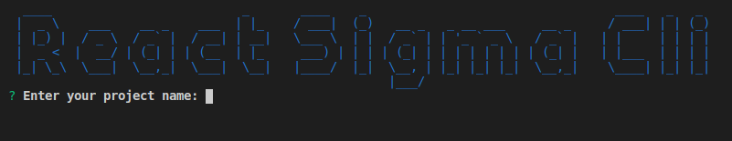

# @sigma-force/react-sigma-cli

**react-sigma-cli** is a framework for **React** that allows you to take this library to another level, integrate the best practices in the industry into your projects.

_You have the idea, **react-sigma-cli** accompanies you to create it_

## Why use `react-sigma-cli`?

By implementing `react-sigma-cli` in your project will be have:

- Installation optimized for removing unnecessary code.
- @react/cli organizes your project in a modular structure, generating a more consistent and ordered code
- Having a highly modularized structure allows you to better distribute the work with your development team
- @react/cli has a package of dependencies that have been verified and tested to offer you a complete and stable development environment
- The way @react/cli organizes your project allows you to have greater productivity when creating code and easier maintenance.
- Easier to run unit tests

## Prerequisites

Before you start using **react-sigma-cli** you must have installed:

- `NodeJS Version 12.16.1` or higher
- `npm Version 6.14.4` or higher

## Getting Started

### Installation

The dependency `@sigma-force/react-sigma-cli` must be installed globally. 

    npm install -g @sigma-force/react-sigma-cli

**Note:** if you require administrative permission use `sudo` for your installation
 
	sudo npm install -g @sigma-force/react-sigma-cli

### Start new project

1. Run in the terminal 

		react-sigma-cli

2. Insert the name of the project

 

### scripts

For start in **developer** mode run in the terminal

	npm run start

For create a bundle for production, run the next comand

	npm run build

To check the code for formatting problems use

	npm run format

To automatically fix formatting problems use

	npm run lint

### Uninstall

	npm uninstall -g @sigma-force/react-sigma-cli

## Documentation

You can find the Kaizen Web Client documentation [on Notion](https://www.notion.so/rulocode/React-cli-7cb832838b334971a37f8b2b8ed9d17e).

The documentation is divided into several sections:

* [Requirements](https://www.notion.so/rulocode/Requirements-75bb9d70b2b94d2abe1070756025a483)

* [Code](https://react-sigma-cli-doc.now.sh/)

## Authors

	<a href='https://github.com/jeff-js' target='_blank'>
		
		Jefferson Aguilar
	</a>

	<a href='https://github.com/cosmosoftroot' target='_blank'>
		
		Iván Darío Sánchez
	</a>

	<a href='https://github.com/wilson-romero' target='_blank'>
		
		Wilson Romero
	</a>

	<a href='https://github.com/rulo-code' target='_blank'>
		
		Andrés Santana
	</a>

## Contributing

Thank you for being here, we're really happy you decided to contribute to the project.

Before you contribute to the project please make sure to read all items below.

* [Contributing Guide](/CONTRIBUTING.md)

## Sponsors

## License

MIT License - Copyright (c) 2020 Σ SIGMA Force
